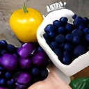

Demonstrating how upscaling images via [Real-ESRGAN](https://github.com/xinntao/Real-ESRGAN) works on-CPU, but produces incorrect output using MPS backend.

Using PyTorch nightly build, `1.13.0.dev20220610`.

# Setup

```bash
git clone https://github.com/Birch-san/mps-repro.git
cd mps-repro

python3 -m venv venv
source ./venv/bin/activate
python3 -m pip install --upgrade pip

#--install Real-ESRGAN
git submodule update --init --recursive
wget https://github.com/xinntao/Real-ESRGAN/releases/download/v0.1.0/RealESRGAN_x4plus.pth -P Real-ESRGAN/experiments/pretrained_models
# GFPGAN is unnecessarily pinned to an old numpy, for which there is no M1 macOS release. my fork fixes this
pip install basicsr facexlib git+https://github.com/Birch-san/GFPGAN.git@newer-numpy
cd Real-ESRGAN
pip install -r requirements.txt
python setup.py develop
cd ..
#--done installing Real-ESRGAN

# our torch nightly probably got nuked by the above, but we do need it for GPU support on macOS
pip install --pre "torch==1.13.0.dev20220610" "torchvision==0.14.0.dev20220609" --extra-index-url https://download.pytorch.org/whl/nightly/cpu
```

# Run

```bash
python repro.py --half_precision_float false --backend_type mps
python repro.py --half_precision_float true --backend_type mps
python repro.py --half_precision_float false --backend_type cpu
# --half_precision_float true on-CPU is unsupported, but that problem's not important.
```

# Results

Attempt to upscale this input image:


Fruit hypothesized by [imagen-pytorch](https://github.com/cene555/Imagen-pytorch).

## CPU

### Half-precision float

[Unsupported](https://github.com/pytorch/pytorch/issues/74625) (`"slow_conv2d_cpu" not implemented for 'Half'`), but that's not what our repro is investigating.

### Double-precision float



Perfectly 2x upsampled fruit.

## MPS

### Half-precision float


Overexposed, white-and-green, high-frequency formless mess.

### Double-precision float


Andy Warhol-esque desaturated tiled fruit.